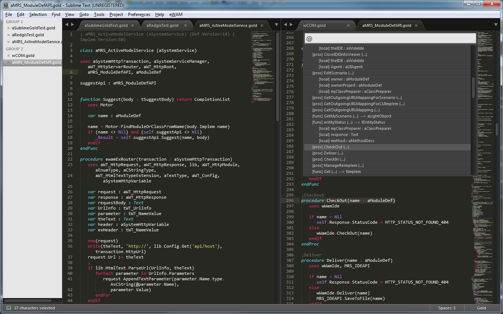
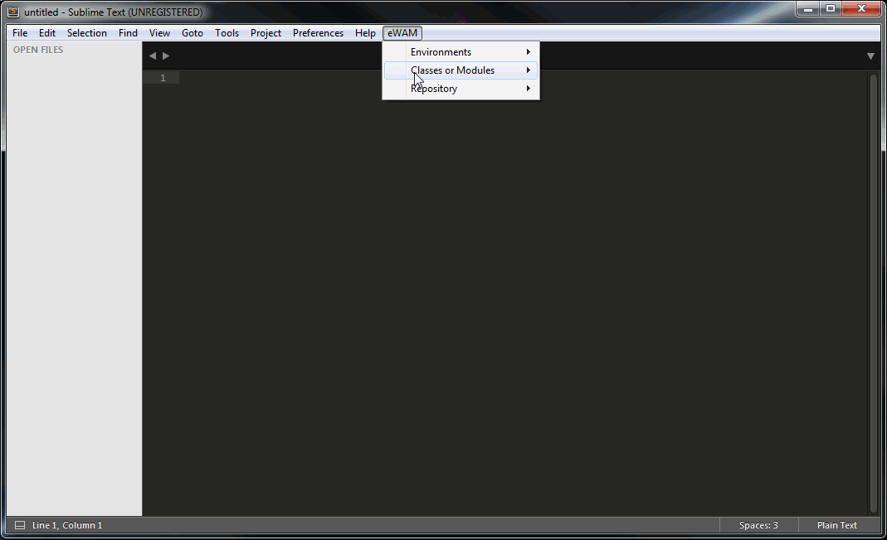
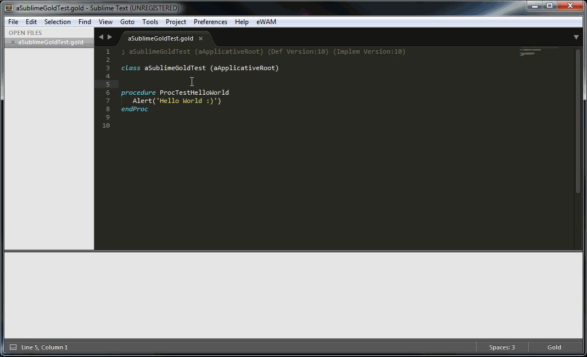
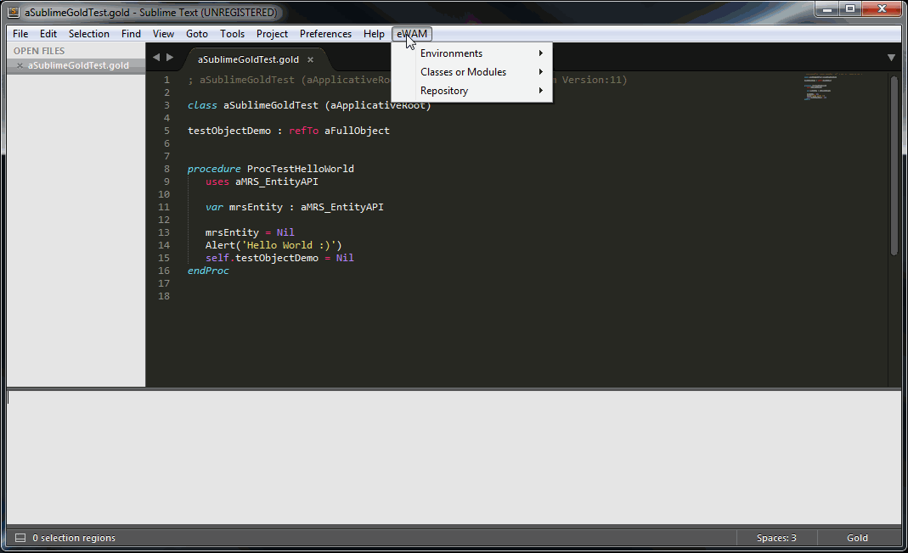
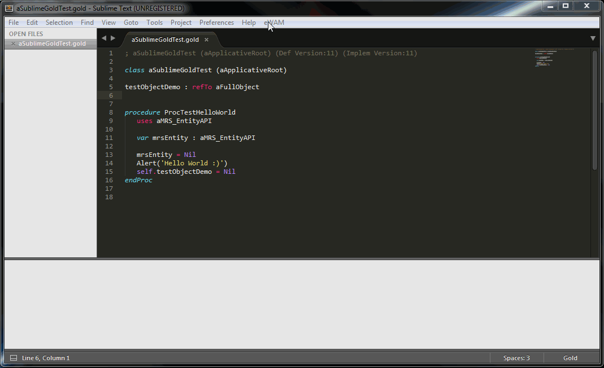
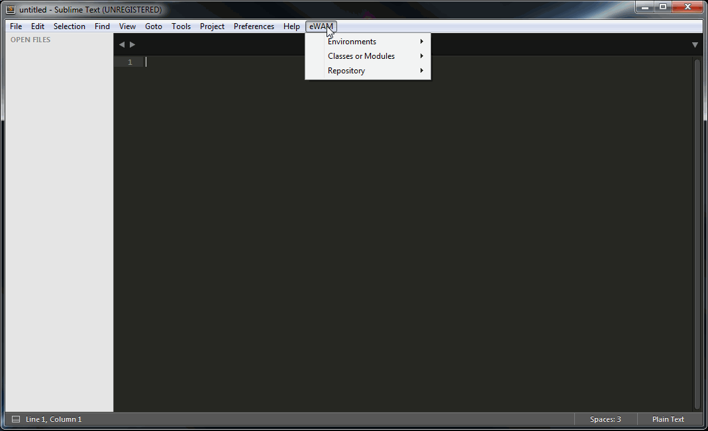
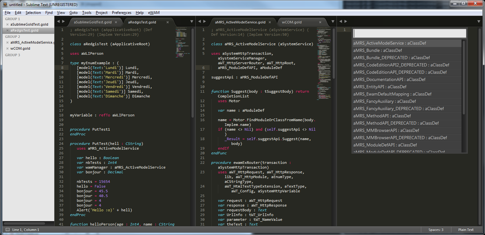

# eWamSublimeAdaptor

## SublimeText "Gold plugin" source code.
Be advised, for now this code is a prototype, a draft. Hence, you will spot some ugly code, some code that's here only for testing purpose, a bunch of commented code lines, clumsy design and lots of debug output in the console. Work in progress.

## Installation
### eWam install
This plugin for SublimeText is based on eWAM APIs. So you need an eWAM 6.1.5 installed.

* Install eWam 6.1.5
  * see : https://github.com/MphasisWyde/WydeActiveModelerAPI	

### Sublime install
The subfolder SublimeCode/ contains the source code (essentially python) used in the SublimeText package.

* copy the content of https://github.com/MphasisWyde/eWamSublimeAdaptor/tree/master/SublimeCode/v1_0/ in "<Sublime Packages Folder>/Gold/" (you will need to create the Gold/ subdirectory)

Depending on how you installed Sublime, your Packages folder can be in <user home>\AppData\Roaming\Sublime Text 3\Packages\ or in <Sublime Install Folder>\Data\Packages\
<user home> may be somthing like that : C:\Users\martinez_r.

## Features

* Gold syntax highlighting
* Symbol navigation inside class
* Symbol navigation accross classes

* Open, create, modify, parse, save class or module
* Autocompletion

* Synchronize environment
* Checkin / checkout / deliver entities

* Consult / modify scenario
* Run a method or a class
* Manage reimplementations

* Setup different eWAM environments

## Customize the plugin

### Syntax highlighting

The syntax highlighting is defined in the file gold.tmLanguage. It is an XML file in the textmate format (kind of a standard for syntax highlighing definitions, also used by other editors, like VSCode for instance).

This file _could_ be edited directly, **but is more easily generated from a more human readable file : gold.YAML-tmLanguage**. How ? Follow the SublimeText (unofficial) documentation steps: http://docs.sublimetext.info/en/latest/extensibility/syntaxdefs.html

### Menus

...are defined and associated to a command in the Main.sublime-menu file.

Commands are defined in python files (see http://docs.sublimetext.info/en/latest/extensibility/plugins.html) by implementing a class inheriting from one of those classes: sublime_plugin.TextCommand, sublime_plugin.WindowCommand, sublime_plugin.ApplicationCommand, depending on your needs.

### Python source code

... extensively uses SublimeText API (http://www.sublimetext.com/docs/3/api_reference.html).

