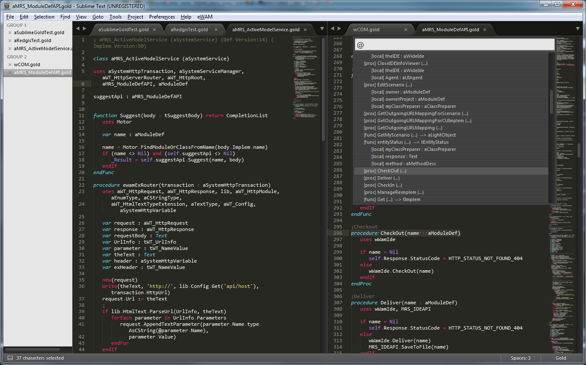
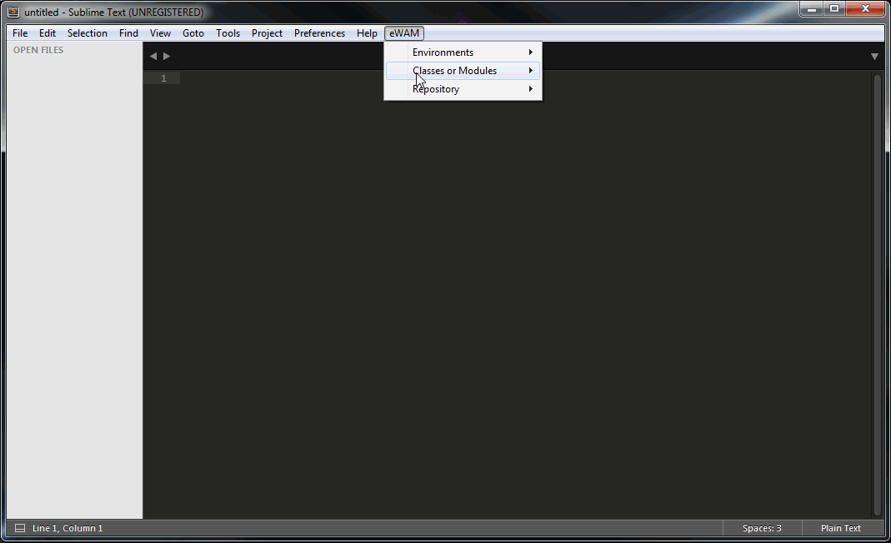
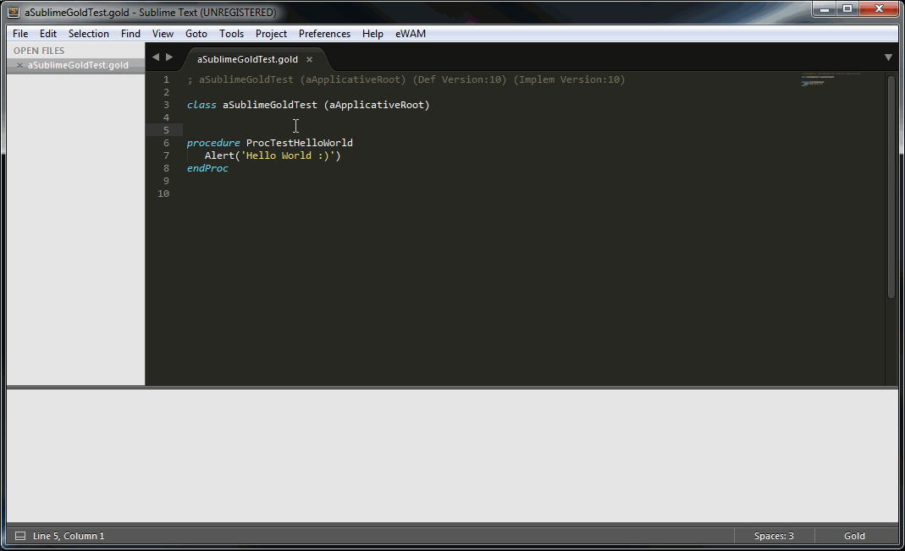
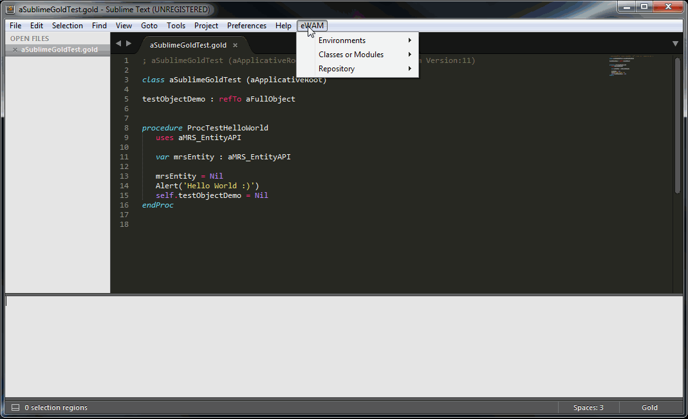
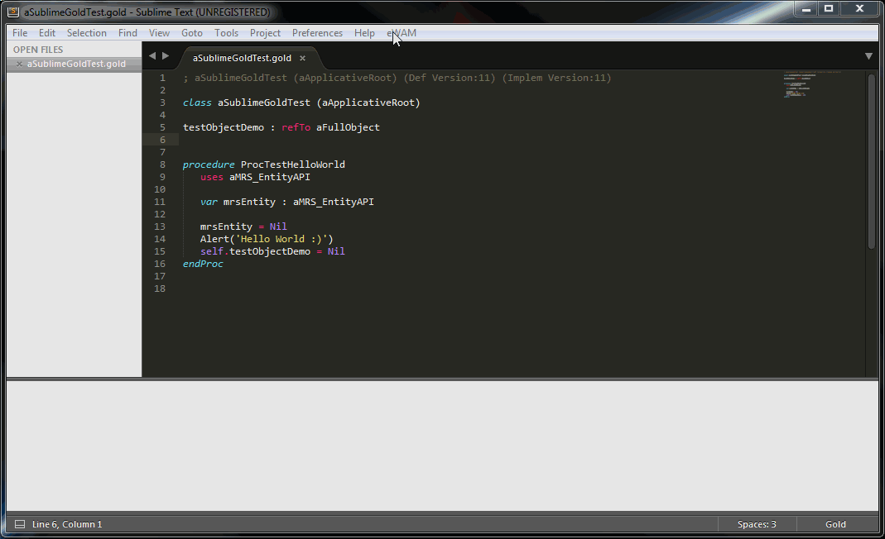
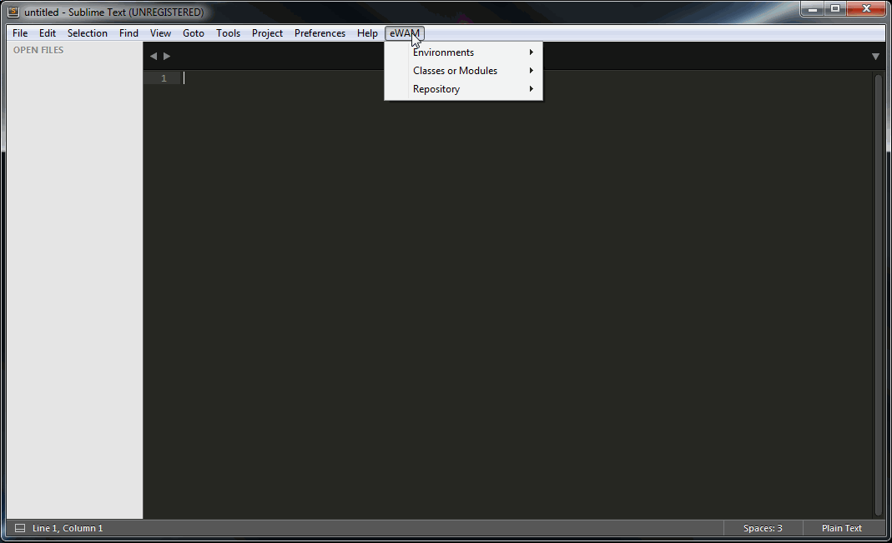
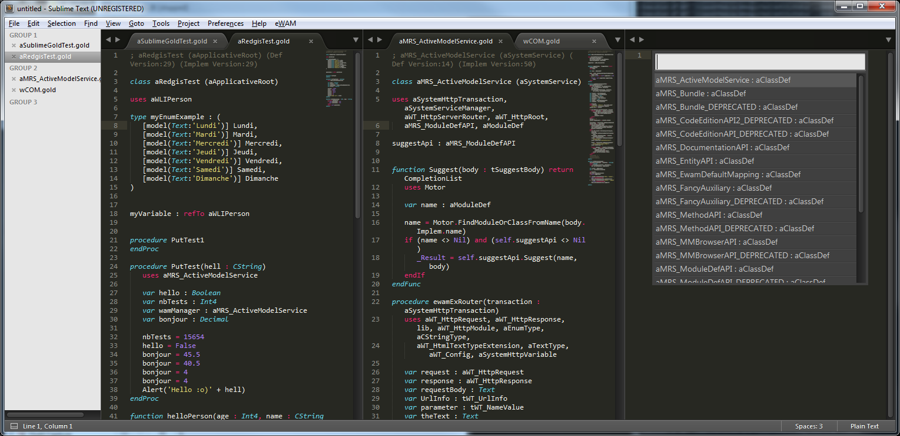

# eWam Sublime Text plugin

## Installation

### eWam install

This plugin for SublimeText is based on eWAM APIs. So you need an eWAM 6.1.5 installed.

* Install eWam 6.1.5
  * see : https://github.com/MphasisWyde/WydeActiveModelerAPI	

### Sublime Plugin install

To install eWAM Sublime Text plugin, you only need to 
* close all Sublime Text instances
* copy the [Gold.sublime-package file](https://github.com/MphasisWyde/eWamSublimeAdaptor/blob/master/SublimeCode/Gold.sublime-package?raw=true) in the "Installed Packages" folder of Sublime Text.
* open Sublime Text

Depending on how you installed Sublime, your "Installed Packages" folder can be in [user home]\AppData\Roaming\Sublime Text 3\Installed Packages\ or in [Sublime Install Folder]\Data\Installed Packages\

[user home] is usually something like that : C:\Users\martinez_r.

You can get the [Gold.sublime-package](https://github.com/MphasisWyde/eWamSublimeAdaptor/blob/master/SublimeCode/Gold.sublime-package?raw=true) file in the SublimeCode/ subdirectory: https://github.com/MphasisWyde/eWamSublimeAdaptor/blob/master/SublimeCode/Gold.sublime-package?raw=true

## Features

* Gold syntax highlighting
* Symbol navigation inside class
* Symbol navigation accross classes

* Open, create, modify, parse, save class or module
* Autocompletion

* Synchronize environment
* Checkin / checkout / deliver entities

* Consult / modify scenario
* Run a method or a class
* Manage reimplementations

* Setup different eWAM environments

## Customize the plugin

### Installing de developpment version of the plugin

ATTENTION : YOU CANNOT INSTALL THE PACKAGE "Gold.sublime-package" AND THIS DEVELOPPMENT PACKAGE AT THE SAME TIME !

The subfolder SublimeCode/ contains the source code (essentially python) used in the SublimeText package.

* remove the Gold.sublime-package file from the defaults packages folder, if you have previously installed it;
* copy the content of https://github.com/MphasisWyde/eWamSublimeAdaptor/tree/master/SublimeCode/v1_0/ in "[Sublime Packages Folder]/Gold/" (you will need to create the Gold/ subdirectory).

Depending on how you installed Sublime, your Packages folder can be in [user home]\AppData\Roaming\Sublime Text 3\Packages\ or in [Sublime Install Folder]\Data\Packages\

[user home] may be somthing like that : C:\Users\martinez_r.

### Syntax highlighting

The syntax highlighting is defined in the file gold.tmLanguage. It is an XML file in the textmate format (kind of a standard for syntax highlighing definitions, also used by other editors, like VSCode for instance).

This file _could_ be edited directly, **but is more easily generated from a more human readable file : gold.YAML-tmLanguage**. How ? Follow the SublimeText (unofficial) documentation steps: http://docs.sublimetext.info/en/latest/extensibility/syntaxdefs.html

### Menus

...are defined and associated to a command in the Main.sublime-menu file.

Commands are defined in python files (see http://docs.sublimetext.info/en/latest/extensibility/plugins.html) by implementing a class inheriting from one of those classes: sublime_plugin.TextCommand, sublime_plugin.WindowCommand, sublime_plugin.ApplicationCommand, depending on your needs.

### Python source code

... extensively uses SublimeText API (http://www.sublimetext.com/docs/3/api_reference.html).

